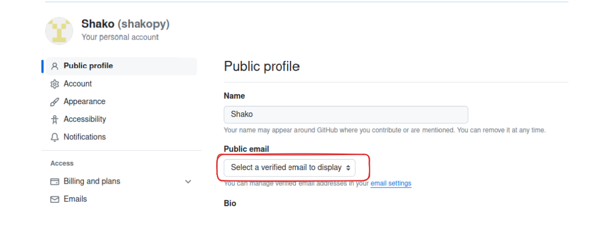
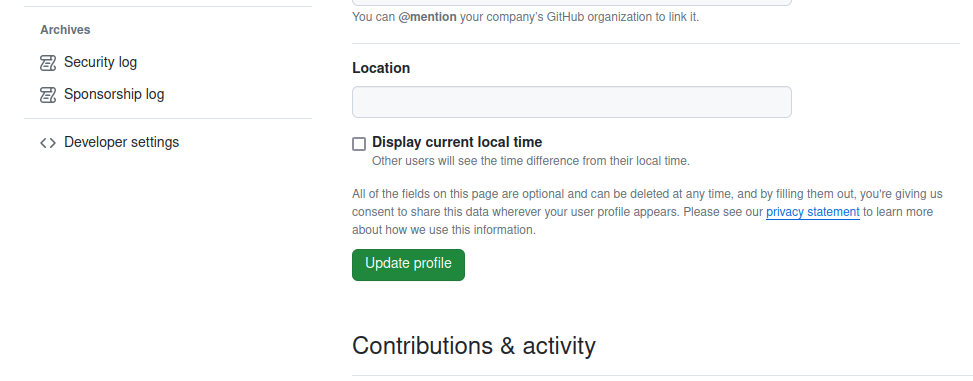

# FAQ

## How to add and activate Public Email address in GitHub?

- Follow the official guide of GitHub adding email address: [Adding Email Address](https://docs.github.com/en/account-and-profile/setting-up-and-managing-your-personal-account-on-github/managing-email-preferences/adding-an-email-address-to-your-github-account){:target="_blank"}

- In the [Settings](https://github.com/settings/profile){:target="_blank"} page, `Public Profile` select the added email address from the list to show

- Do not forget to save your changes, by clicking `Update Profile` button:

- Finally, [Logout](https://beta.epiclaunchx.io/accounts/logout){:target="_blank"} and [Login](https://beta.epiclaunchx.io/accounts/login){:target="_blank"} back, in the [General Settings](https://beta.epiclaunchx.io/settings/general/){:target="_blank"} you will the see the updated email address.

