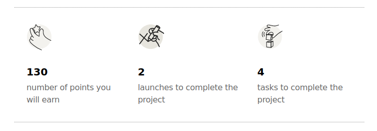
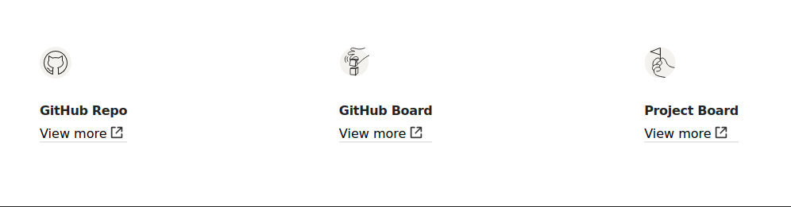
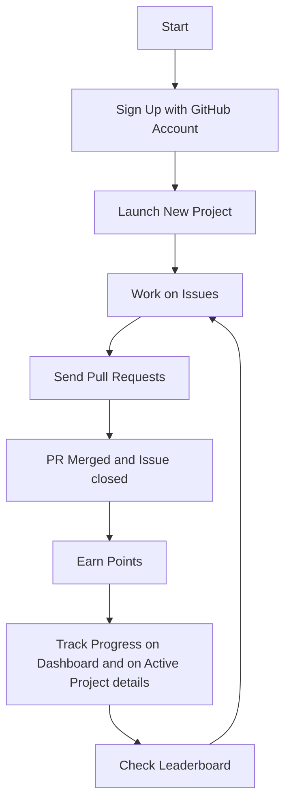

# How it works?

## Intro

Welcome to EpicLaunchX, where you can earn points and compete with other engineers by developing real projects using an iterative approach. 

We focus on Python projects and impart real-world software engineering skills.

Our platform integrates directly with GitHub, enabling project management, issue tracking, pull requests, and point rewards for contributions

### Step 1: Sign Up and Setup

If you don't have GitHub account, create one here [GitHub](https://github.com/signup).
We recommend adding an email to your GitHub account. To enable your public email, visit the [Adding an email address to your GitHub account](https://docs.github.com/en/account-and-profile/setting-up-and-managing-your-personal-account-on-github/managing-email-preferences/adding-an-email-address-to-your-github-account) page.

Already have a GitHub account? Sign up with [EpicLaunchX](https://beta.epiclaunchx.io/accounts/signup/)

> We only require your GitHub username and email (if activated).

After signing up, you'll select your [Interests](https://beta.epiclaunchx.io/interests/) (e.g, Backend Development or Frontend Development, etc)
followed by tracking progress on the [Dashboards](https://beta.epiclaunchx.io/dashboard/) page.

---

### Step 2: Launch Your First Project

1. Select Your Project: Choose a project from your dashboard, review project details, and click "Launch Project." Details include potential points, number of launches(sprints) required, and total project tasks categorized by complexity (Easy, Medium, Hard).

2. Automated Repository Creation: Upon launch, our platform creates a GitHub repository under your account with an initial sprint board and issues.

3. Collaboration Setup: You'll be added as a collaborator to this new repository.

---

### Step 3: Earn Points by Contributing

After a successful launch:

- GitHub Repo: Access the newly created repo where you're a collaborator. Accept the invitation if needed.

- GitHub Board: Utilize the GitHub Project - Launch board to track progress.

- Project Board: A key platform component providing task details, hints, and completion guidelines for each sprint.

### Workflow

1. Work on Tasks: Check your Project Board for available tasks, categorized by complexity.

> Each Task corresponds the same GitHub Issue

2. Send Pull Requests: Commit changes, send pull requests via GitHub, linking them to specific issues.

3. Earning Points: Points are awarded upon PR merge and issue closure, with transparent point allocation visible for each task.

---

### Terminology We Use

- Launches: Sprints within EpicLaunchX; Projects consist of Launches and Launches consist of Tasks.

- Active Project: A live entity after launch.

- Tracks: Higher-level units where Projects reside.

---

## Important Patterns to Follow

Follow best practices for Commit messages, PR names, and Python folder structure. Review Launch and Task requirements for technical specifics.

* For General conventions and more please read [Features](features.md)

## Flow

