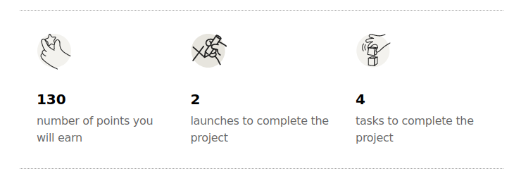

# How it works?

## Intro

Welcome to EpicLaunchX, where you can earn points and compete with other engineers by developing a real project using iterative approach.

Currently, we focus on Python projects and we try to deliver best practices by teaching real-world software engineering skills.

Our platform integrates directly with GitHub, allowing you to manage projects, track issues, and pull requests, and earn points for your contributions.

### Step 1: Sign Up and Setup

If you don't have GitHub account, you need to create one. Please visit [GitHub](https://github.com/signup) and create an account.
We also strongly advice to add email to your GitHub account. To enable public email please visit [Adding an email address to your GitHub account](https://docs.github.com/en/account-and-profile/setting-up-and-managing-your-personal-account-on-github/managing-email-preferences/adding-an-email-address-to-your-github-account) page and proceed as described.

If you have ready-to-go GitHub account then signup in [EpicLaunchX](https://beta.epiclaunchx.io/accounts/signup/)

> The only personal information we need is your username and email if activated in GitHub account.

After signup you will be redirected to the [Interests](https://beta.epiclaunchx.io/interests/) page to choose your interest such as Backend Development or Frontend Development, etc.

After Interests you will be redirected to the [Dashboards](https://beta.epiclaunchx.io/dashboard/) page to track your progress.

### Step 2: Launch your first Project

* Select Your Project: From your dashboard, choose the Project you want to Launch, see the details of the Project and then click the `Launch project` button.
In project details you can see, important information, such as how much points you will earn if you complete the project, how many `Launches(Sprints)` you need to complete the project and the total number of the tasks in the Project.

> Projects have complexity level: Easy, Medium and Hard and vary in points based in the complexity.

* Automated Repository Creation: Upon project launch, our platform automatically creates a new GitHub repository under your account and sets up the initial sprint board and issues
* Collaboration Setup: You'll be added as a collaborator to this new repository.

### Step 3: Earn Points by Contributing

After successful Launch you will see three main links: GitHub Repo, GitHub Board and Project Board:

GitHub Repo - the repo just created in our GitHub Organization and you have been added as a collaborator to this repo. 
Therefore, before going further, you need to accept the collaborator invitation at GitHub.

GitHub Board - is the GitHub Project - Launch board for tracking your progress.

Project Board - this is one of the crucial parts of the our platform, where you can learn more about Tasks, Hints for the tasks and How to Complete sections for each Launch.

* Work on Issues: Navigate to your Project Board to see available tasks. Issues vary in points based on complexity.
Send Pull Requests: Once you've completed work on an issue, commit your changes and send a pull request (PR) through GitHub. Make sure to link the PR to the specific issue it resolves.
Earning Points: When a PR is merged, and the related issue is closed, points are automatically awarded to your account. The points system is transparent, with each issue and PR showing the potential points earnable.